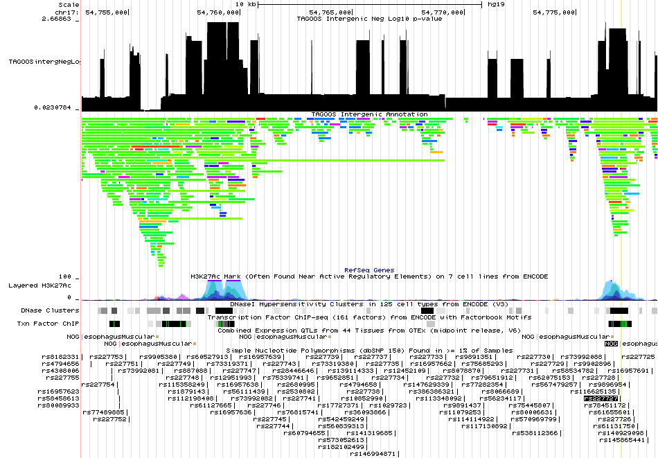

# About

TAGOOS is a nucleotide scoring tool for non-coding (Intronic and intergenic) regions. There are two underlying models trained with the <a href="https://xgboost.readthedocs.io/en/latest/" target="_blank">XGBOOST</a> algorithm using intronic and intergenic associated SNPs (GWAS P-value < 0.8) from the <a href="https://grasp.nhlbi.nih.gov/Overview.aspx" target="_blank">GRASP</a> database. The predictive variables have been selected by the learning algorithm among 4684 gene regulation related annotations such as histone modifications, eQTLs or transcription factors in different tissues from the <a href="http://enhancer.binf.ku.dk/presets/" target="_blank">Expressed enhancers</a>, <a href="https://www.encodeproject.org/" target="_blank">ENCODE</a>, <a href="https://www.gtexportal.org/home/" target="_blank">GTEx</a>, <a href="http://tagc.univ-mrs.fr/remap/" target="_blank">ReMap</a>, <a href="http://www.roadmapepigenomics.org/" target="_blank">RoadMap</a> and <a href="http://www.cell.com/abstract/S0092-8674(13)01227-0" target="_blank">Young H3K27ac publication</a>.

The TAGOOS pipeline is provided in a <a href="https://github.com/aitgon/tagoos" target="_blank">Github</a> repository.

The TAGOOS scores can be accessed here:

- Through the UCSC genome browser
- Downloading annotation bed files
- Without downloading the files through the TABIX software 

*UCSC browser screen shot of the rs227727 locus (hg19/chr17:54774450-54779459) with the negative log 10 of the p-value and the annotations.*

